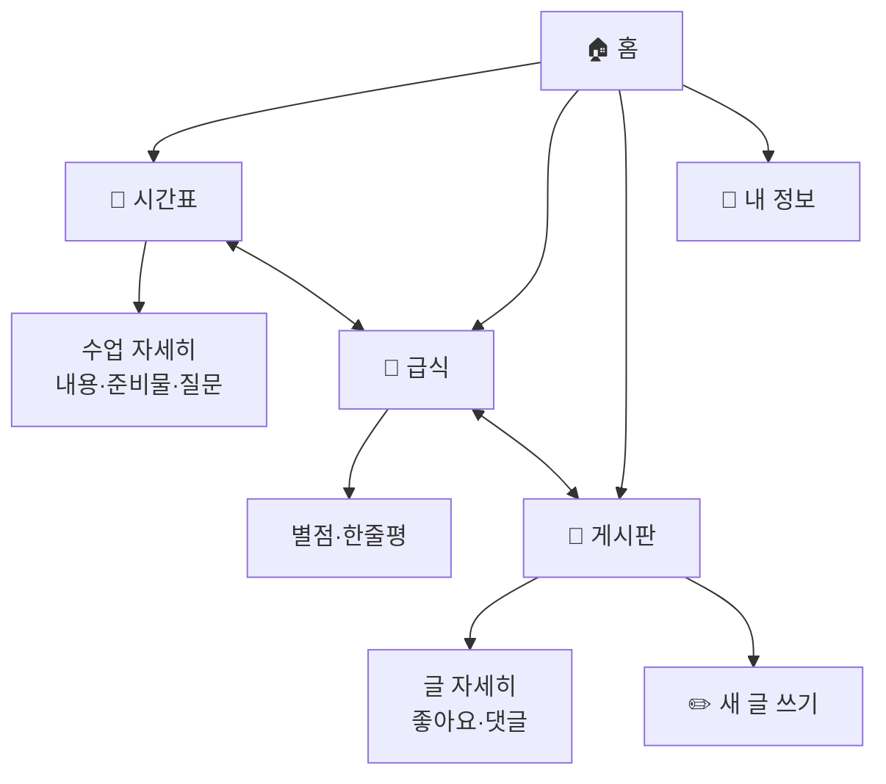

# 📘 스쿨모아 (School-Moa) — 개발 기획서 (쉬운 설명판)

> 학교의 모든 정보를 **모아** 보는 학생용 앱
> *2026 바이브 벤처(Vibe Venture) 프로젝트 · 백준기 · Day1·Day2 워크북 기반*

### 🙋 이 문서는 뭐예요?
이 문서는 **"스쿨모아 앱을 어떻게 만들지 적어둔 설계도"** 예요.
집을 짓기 전에 도면을 그리는 것처럼, 앱을 만들기 전에 **무엇을 · 왜 · 어떻게** 만들지 미리 정리한 거예요.
어려운 컴퓨터 용어가 나오면 바로 옆에 **"쉽게 말하면"** 으로 풀어서 설명해 둘게요. 🙂

> 📖 모르는 단어가 나오면 맨 아래 **[11. 용어 사전](#11--용어-사전-모르는-말-여기서-찾기)** 을 보세요!

| 항목 | 내용 |
|------|------|
| **프로젝트명** | 스쿨모아 (School-Moa) |
| **한 줄 소개** | 시간표·급식·공지를 한곳에 모아, 학생이 미리 준비하게 돕는 앱 |
| **개발자** | 백준기 (대구왕선초등학교, 중1) |
| **문서 버전** | v1.0 (개발을 시작하기 위한 자세한 설계도) |
| **앱 종류** | 휴대폰에서 보기 편한 웹앱 — 설치 없이 인터넷 창에서 바로 실행 |

---

## 1. 📌 왜 이 앱을 만들까? (문제 찾기)

### 1.1 무엇이 불편했나
학교에 왔는데 **오늘 무슨 수업을 하는지 몰라서 예습을 못 해요.**
선생님이 준비물과 수업 내용을 **말로만** 알려주고 끝나서, 미리 챙기기가 어려워요.

> **💡 한 문장으로 정리한 문제**
> "중학생은 *학교 가기 전에* *수업 내용과 준비물*을 *미리 자세히 알 수 없어서* 예습과 준비를 못 한다.
> 왜냐하면 그 정보가 선생님 말로만 전달되고, 한곳에 모여 있지 않기 때문이다."

### 1.2 "왜?"를 5번 물어 진짜 원인 찾기 (5 Whys)
> 🔍 **쉽게 말하면**: 문제의 *진짜 뿌리*를 찾으려고 "왜?"를 계속 물어보는 방법이에요. 양파 껍질 까듯이요.

| 단계 | 질문 | 답 |
|------|------|------|
| 1 | 왜 예습을 못 하나? | 오늘 뭘 배우는지 모른다 |
| 2 | 왜 모르나? | 선생님이 말로만 알려주고 끝난다 |
| 3 | 왜 말로만 전달되나? | 정보를 적어두는 공통 공간이 없다 |
| 4 | 왜 공통 공간이 없나? | 과목·급식·공지가 제각각 흩어져 있다 |
| 5 | 왜 흩어져 있나? | 학생용으로 **한곳에 모아주는 도구**가 없다 |
| 🔑 **진짜 원인** | | 학교 정보를 학생 입장에서 **한곳에 모아 미리 보여주는 앱이 없다** |

### 1.3 이 앱이 있으면 뭐가 좋아지나 (기대 효과)
- 🎯 **미리 알고 준비**할 수 있어 규칙적인 생활이 가능해요.
- 🎒 준비물을 안 빠뜨려서 **당황하거나 벌점 받는 일이 줄어요.**
- 💬 선생님께 댓글로 질문해서 **수업 전에 궁금증을 해결**할 수 있어요.

---

## 2. 👤 누가 쓰는 앱일까? (사용자 정하기)

> 🔍 **쉽게 말하면**: 앱을 만들 때는 "딱 한 명의 진짜 사용자"를 떠올리면 좋아요.
> 그래야 그 사람에게 진짜 필요한 기능만 만들 수 있거든요. 이 가상의 대표 사용자를 **페르소나**라고 해요.

| 구분 | 내용 |
|------|------|
| 이름 / 학년 | 백준기 / 중1 |
| 학교 | 대구왕선초등학교 |
| 휴대폰 사용 | 하루 약 3시간 (유튜브·인스타·카톡·게임) |
| 지금 불편한 점 | 수업 내용·준비물을 미리 몰라서 예습/준비를 못 함 |
| 바라는 점 | 선생님이 수업 내용을 **미리 자세히** 알려주면 좋겠다 |
| 한마디 | *"선생님들이 미리 자세하게 수업내용을 알려주셨으면 좋겠는데..."* |

### 하루 동안 겪는 불편함 (사용자 여정맵)
> 🔍 **쉽게 말하면**: 사용자가 하루를 보내면서 겪는 일을 순서대로 적고,
> 어디서 답답한지(😞) 찾는 표예요. ⚡ 표시한 곳이 바로 **"앱이 도와줄 수 있는 지점"** 이에요.

| 순서 | 지금 하는 행동 | 기분 | ⚡앱이 도와줄 곳 |
|------|-----------|:----:|:----:|
| 1 | 하루 전엔 과목만 안다 | 😐 | ⚡ |
| 2 | 학교 왔는데 수업 내용을 몰라 예습 못 함 | 😞 | ⚡ |
| 3 | 준비물을 안 가져와서 곤란 | 😞 | ⚡ |
| 4 | 급식 메뉴를 몰라서 기대했다 실망 | 😐 | ⚡ |
| 5 | 중요한 공지를 놓침 | 😞 | ⚡ |

> ⚡ 표시한 5곳 → 이게 바로 아래 **3대 핵심 기능**이 됩니다!

---

## 3. 🎯 무슨 기능을 만들까? (기능 정리)

### 3.1 어떤 기능부터 만들까? (우선순위 정하기)
> 🔍 **쉽게 말하면**: 기능이 많다고 다 좋은 게 아니에요. 시간은 정해져 있으니까
> **"중요하고 + 만들기 쉬운 것"** 부터 만들어야 해요. 아래 4칸 표로 정리했어요.

| | **만들기 쉬움 👍** | **만들기 어려움 😤** |
|---|---|---|
| **중요해요 ⭐** | ① **시간표·급식·게시판** ← 제일 먼저! | ② 댓글 실시간 알림 (멘토쌤이랑 도전) |
| **덜 중요해요** | ③ 상점/벌점 보여주기 (시간 남으면) | ④ 학교 시스템이랑 연결 (지금은 보류) |

➡️ 그래서 **①번(시간표·급식·게시판)** 을 먼저 완성하는 게 목표예요.
이렇게 "꼭 필요한 핵심만 먼저 만든 첫 버전"을 **MVP** 라고 불러요.

### 3.2 꼭 만들 핵심 기능 (= MVP)
> 표 보는 법: **ID** 는 기능에 붙인 번호표예요(나중에 "F1-3 다 했어?" 처럼 부르기 편하라고요).

#### 📅 F1. 시간표
| ID | 기능 | 무슨 일을 하나 |
|----|------|------|
| F1-1 | 요일 고르기 | 월~금 버튼을 눌러 그 요일 시간표 보기 |
| F1-2 | 수업 목록 보기 | 몇 교시·몇 시·무슨 과목·어떤 선생님인지 표시 |
| F1-3 | 수업 눌러서 자세히 보기 | **그날 배울 내용 + 준비물**이 펼쳐짐 (이게 제일 중요!) |
| F1-4 | 선생님께 질문하기 | 수업마다 댓글로 궁금한 걸 물어보기 |

#### 🍱 F2. 급식
| ID | 기능 | 무슨 일을 하나 |
|----|------|------|
| F2-1 | 오늘 메뉴 보기 | 요일별 메뉴·열량(칼로리)·알레르기 정보 표시 |
| F2-2 | 별점 주기 | 별 1~5개로 평가, 평균 점수와 몇 명이 줬는지 표시 |
| F2-3 | 한줄평 쓰기 | "오늘 급식 어땠어요?" 한 줄 의견 남기기 |

#### 💬 F3. 게시판
| ID | 기능 | 무슨 일을 하나 |
|----|------|------|
| F3-1 | 공지 보기 | 선생님 공지를 목록으로, 중요한 글은 📌고정 표시 |
| F3-2 | 좋아요 누르기 | 마음에 드는 글에 하트 ❤️ 누르기 |
| F3-3 | 댓글 달기 | 글마다 댓글로 이야기 나누기 |
| F3-4 | 새 글 쓰기 | 학생도 직접 글을 올릴 수 있음 |

### 3.3 시간 남으면 만들 기능 (심화)
- 상점/벌점 보여주기, 내 정보 화면
- 데이터 초기화 (앱을 처음 상태로 되돌리기)

### 3.4 나중에 도전할 기능 (지금은 안 만듦)
- 로그인(아이디·비밀번호), 알림(푸시), 선생님 전용 입력 페이지, 진짜 학교 시간표 연결, 인터넷 서버 저장
> 💡 지금은 욕심내지 않고 **핵심 3개부터!** 많이 넣으려다 하나도 못 만드는 게 제일 위험해요.

---

## 4. 🗺️ 화면을 어떻게 구성할까? (화면 지도)

> 🔍 **쉽게 말하면**: 앱 안에 어떤 화면들이 있고, 그 안에 뭐가 들어가는지 정리한 "앱 지도"예요.

```
스쿨모아
├── 🏠 홈        : 인사 · 상점/벌점 · 다음 수업 · 오늘 급식 · 공지 요약
├── 📅 시간표    : 요일 고르기 → 수업 목록 → 수업 자세히(내용·준비물·질문)
├── 🍱 급식      : 요일 고르기 → 메뉴 → 별점 → 한줄평
├── 💬 게시판    : 공지 목록 → 좋아요/댓글 → 새 글 쓰기
└── 👤 내 정보   : 프로필 · 상점/벌점 · 데이터 초기화
```

### 화면끼리 어떻게 이동할까 (화면 흐름도)
> 💡 화살표(→)는 "이 화면에서 저 화면으로 갈 수 있다"는 뜻이에요.



> 👍 화면 맨 아래에 항상 **탭 버튼 4개(홈·시간표·급식·게시판)** 가 있어서
> **3번만 누르면** 원하는 기능에 도착할 수 있어요.

---

## 5. 🗃️ 정보를 어떻게 저장할까? (데이터 정리)

> 🔍 **쉽게 말하면**: 앱이 기억해야 할 정보(시간표·급식·글 등)를 어떤 모양으로 보관할지 정하는 거예요.
> 마치 책장에 칸을 나눠서 "여긴 시간표, 여긴 급식" 하고 정리하는 것과 같아요.

📦 **저장 장소**: 휴대폰 인터넷 창 안의 작은 메모장인 **localStorage** 에 `schoolmoa_v1` 이라는 이름으로 저장해요.
> 💡 **localStorage 가 뭐예요?** 인터넷 창이 스스로 가지고 있는 작은 저장 공간이에요.
> 여기에 적어두면 **창을 껐다 켜도, 새로고침해도 내용이 안 사라져요.** (서버나 인터넷 연결이 필요 없어요!)

### 정보들이 어떻게 연결되나 (관계도)
> 💡 아래 그림에서 선은 "포함한다 / 가지고 있다"는 뜻이에요.
> 예: 시간표는 여러 개의 수업을 가지고 있고, 수업은 여러 개의 댓글을 가지고 있어요.

```mermaid
erDiagram
    USER ||--o{ TIMETABLE : has
    TIMETABLE ||--o{ LESSON : contains
    LESSON ||--o{ COMMENT : has
    USER ||--o{ MEAL : has
    MEAL ||--o{ REVIEW : has
    USER ||--o{ POST : writes
    POST ||--o{ COMMENT : has

    USER { string name; string school; string grade; int merit; int penalty }
    LESSON { int period; string time; string subject; string teacher; string content; array materials }
    COMMENT { string role; string name; string text; string time }
    MEAL { array menu; int kcal; string allergy; array ratings }
    REVIEW { string name; string text; string time }
    POST { int id; string author; string role; bool pinned; string title; string body; int likes; bool liked }
```

### 실제로 저장되는 정보 모양 (예시)
> 🔍 **쉽게 말하면**: 아래는 컴퓨터가 정보를 적어두는 방식(JSON)이에요.
> `"이름": "값"` 처럼 **이름표 + 내용** 짝으로 적어요. 사전에서 단어 찾는 것과 비슷해요!

```jsonc
{
  // 👤 내 정보
  "user":   { "name": "백준기", "grade": "중1", "merit": 12, "penalty": 3 },

  // 📅 시간표 (요일별로 수업이 들어있음)
  "timetable": {
    "월": [
      { "period": 1, "time": "09:00", "subject": "국어", "teacher": "김하늘 선생님",
        "content": "시 감상 + 모둠 낭송", "materials": ["국어 교과서","공책","색연필"],
        "comments": [ { "role": "teacher", "name": "김하늘", "text": "...", "time": "어제 17:20" } ] }
    ]
  },

  // 🍱 급식
  "meals": { "월": { "menu": ["흑미밥","미역국","닭갈비"], "kcal": 685, "allergy": "5,6,13", "ratings": [5,4,5], "reviews": [] } },

  // 💬 게시판
  "board": [ { "id": 1, "author": "담임 선생님", "role": "teacher", "pinned": true,
               "title": "현장체험학습 안내", "body": "...", "likes": 24, "liked": false, "comments": [] } ]
}
```

> 📌 영어 단어 뜻: `name`=이름, `period`=교시, `time`=시간, `subject`=과목, `teacher`=선생님,
> `content`=수업내용, `materials`=준비물, `comments`=댓글, `menu`=메뉴, `kcal`=열량,
> `ratings`=별점들, `likes`=좋아요 수, `pinned`=고정여부, `title`=제목, `body`=내용

---

## 6. 🛠️ 무엇으로 만들까? (재료와 도구)

> 🔍 **쉽게 말하면**: 앱을 만드는 데 쓰는 "재료"예요. 요리로 치면 어떤 재료로 요리할지 정하는 거예요.

| 재료 | 역할 | 쉽게 말하면 |
|------|------|------|
| **HTML** | 화면의 뼈대 | 집의 **벽과 방** — 글자·버튼·칸을 만든다 |
| **CSS** | 화면 꾸미기 | 집의 **페인트와 인테리어** — 색·크기·모양을 예쁘게 |
| **JavaScript** | 움직이게 하기 | 집의 **전기·스위치** — 버튼 누르면 반응하게 |
| **localStorage** | 저장하기 | 집 안의 **서랍** — 적은 내용을 보관 |
| **Noto Sans KR** | 글씨체 | 한글이 또렷하게 보이는 **예쁜 글꼴** |

> 💡 이 4가지(HTML·CSS·JS·localStorage)만 있으면 **설치 프로그램도, 인터넷 서버도 없이** 앱이 돌아가요. 그래서 처음 만들기에 딱 좋아요!

### 만들 파일들 (앱은 이 파일들로 이루어져요)
```
vibe_coding 1/
├── index.html   # 화면 뼈대 (휴대폰 모양 틀 + 아래 탭 버튼)
├── styles.css   # 화면 꾸미기 (색·모양)
├── app.js       # 정보 + 화면 그리기 + 버튼 동작
└── readme.md    # 바로 이 설계도 문서
```

### app.js 안에 들어갈 부품들 (함수)
> 🔍 **쉽게 말하면**: **함수**는 "어떤 일을 하는 작은 기계" 예요. 이름을 부르면 그 일을 해줘요.

- `seedData()` — 처음에 보여줄 **샘플 정보**(시간표·급식·글)를 준비하는 기계
- `load()` / `save()` — 서랍에서 정보를 **꺼내고 / 넣는** 기계
- `render()` — 지금 선택된 탭에 맞게 **화면을 그려주는** 기계
- `renderHome / renderTimetable / renderMeal / renderBoard` — **각 화면**을 그리는 기계들
- `switchTab()` — 아래 **탭을 눌렀을 때 화면을 바꿔주는** 기계
- `toast()` — "등록됐어요!" 같은 **알림 메시지를 띄우는** 기계

---

## 7. ✅ 잘 만들었다는 기준 (지켜야 할 약속)

> 🔍 **쉽게 말하면**: "기능이 되네/안 되네" 말고도, **좋은 앱이 되려면 지켜야 할 약속**들이에요.

| 약속 | 무슨 뜻 |
|------|------|
| 📱 화면 맞춤 | 여러 휴대폰(가로 360~412칸)에서 화면이 안 깨지게 |
| ⚡ 빠르게 | 무거운 거 안 쓰고, 켜자마자 첫 화면이 바로 보이게 |
| 💾 안 잃어버리기 | 새로고침하거나 다시 들어와도 내가 쓴 내용이 남아있게 |
| 👀 보기 쉽게 | 글씨 크게, 색 잘 구분되게, 이모지로 한눈에 알아보게 |
| 🔒 안전하게 | 누가 이상한 글자를 입력해도 앱이 안 망가지게 (XSS 막기) |

> 💡 **XSS 가 뭐예요?** 나쁜 사람이 입력창에 몰래 **컴퓨터 명령어**를 적어서 앱을 망가뜨리는 장난이에요.
> 그래서 사용자가 쓴 글을 화면에 보여줄 때 **그냥 글자로만** 보이게 처리해서(escape) 막아요.

---

## 8. 🗓️ 언제까지 무엇을 만들까? (개발 계획)

| 기간 | 단계 | 목표 |
|------|------|------|
| **5월** | 바이브코딩 | 핵심 3기능(시간표·급식·게시판) 완성 (= MVP) |
| **6~8월** | 멘토링 1차 | 디자인 더 예쁘게 · 선생님 댓글/알림 발전 |
| **9~11월** | 멘토링 2차 | 로그인·인터넷 저장·진짜 시간표 연결 도전 |

### 5월에 할 일 체크리스트 ✅
> 💡 하나씩 끝낼 때마다 `[ ]` 를 `[x]` 로 바꾸면 진행 상황이 보여요!

- [ ] 화면 뼈대(HTML) + 아래 탭 버튼 만들기
- [ ] 화면 꾸미기(CSS) — 휴대폰에서 예쁘게
- [ ] 시간표: 요일 바꾸기 · 수업 자세히 보기 · 질문 댓글
- [ ] 급식: 메뉴 · 별점 · 한줄평
- [ ] 게시판: 공지 · 좋아요 · 댓글 · 새 글
- [ ] 저장 기능(localStorage) — 내용 안 사라지게
- [ ] 휴대폰/컴퓨터 인터넷 창에서 잘 되는지 테스트

---

## 9. 🎤 발표는 이렇게 (3문장 피칭)
> 🔍 **쉽게 말하면**: 친구·심사위원 앞에서 내 앱을 짧고 멋지게 소개하는 3문장이에요.

1. 나는 **"학교 가기 전에 수업 내용·준비물을 미리 알 수 없는 문제"** 를 해결하는 **스쿨모아**를 만들었다.
2. 핵심 기능은 **시간표(수업 내용·준비물 미리보기), 급식(메뉴·의견), 게시판(공지·소통)** 이다.
3. 이 앱이 있으면 학생이 **미리 알고 준비**해서 규칙적인 생활을 할 수 있다.

---

## 10. ▶️ 앱을 어떻게 실행하나
1. `index.html` 파일을 **두 번 클릭**하거나 인터넷 창으로 열면 바로 실행돼요.
2. 내가 쓴 내용(댓글·급식 의견 등)은 **자동으로 저장**돼요.
3. 처음 상태로 되돌리고 싶으면 → **내 정보 → 데이터 초기화** 를 누르면 돼요.

---

## 11. 📖 용어 사전 (모르는 말 여기서 찾기)

| 용어 | 쉬운 설명 |
|------|------|
| **웹앱** | 설치 없이 인터넷 창에서 바로 쓰는 앱 |
| **MVP** | "꼭 필요한 핵심만 담은 첫 번째 버전". 욕심 안 부리고 중요한 것부터! |
| **페르소나** | 앱을 쓸 "딱 한 명의 대표 사용자"를 정해 상상하는 것 |
| **사용자 여정맵** | 사용자가 하루 동안 겪는 일을 순서대로 적어 불편한 곳을 찾는 표 |
| **5 Whys** | "왜?"를 5번 물어 문제의 진짜 원인을 찾는 방법 |
| **우선순위 매트릭스** | 중요도와 난이도로 4칸을 나눠 "뭘 먼저 만들지" 정하는 표 |
| **HTML** | 화면의 뼈대(글자·버튼·칸)를 만드는 재료 |
| **CSS** | 화면을 예쁘게 꾸미는 재료(색·크기·모양) |
| **JavaScript (JS)** | 버튼을 누르면 반응하게 만드는 재료 |
| **함수** | 이름을 부르면 정해진 일을 해주는 작은 기계(부품) |
| **localStorage** | 인터넷 창 안의 작은 저장 서랍. 껐다 켜도 안 사라짐 |
| **JSON** | 컴퓨터가 정보를 "이름표 + 내용" 짝으로 적어두는 방식 |
| **데이터 모델** | 정보를 어떤 모양으로 저장할지 미리 정해둔 설계 |
| **렌더(render)** | 화면에 글자·버튼을 실제로 그려서 보여주는 것 |
| **탭** | 화면 아래의 버튼들(홈·시간표·급식·게시판) |
| **토스트(toast)** | 잠깐 떴다 사라지는 작은 알림 메시지 |
| **XSS** | 입력창에 나쁜 명령어를 넣는 장난. 앱을 안전하게 막아야 함 |

---

## 12. 🚀 2차 개발 확장 기능 (나중에 추가)

- 로그인/회원 기능
- 선생님 전용 글 작성/관리 화면
- 실시간 알림(댓글/공지)
- 학교 실제 시간표/급식 API 연동
- 서버 DB 저장(기기 바꿔도 데이터 유지)

---
*문서 끝 · 2026 바이브 벤처 프로젝트 — Day1·Day2 워크북 기반*
## 13. 🔐 학교 API 연동 + 보안 설정 (중요)

### 13.1 왜 서버 프록시를 쓰나요?
- API 키를 `app.js`에 넣으면 브라우저 개발자도구에서 키가 보여서 유출 위험이 큽니다.
- 그래서 키는 `.env`(서버 전용 파일)에만 넣고, 프런트는 `/api/meal`, `/api/timetable`만 호출합니다.

### 13.2 처음 1회 설정
1. `.env.example` 파일을 복사해서 `.env` 파일을 만듭니다.
2. `.env` 값 입력:
  - `NEIS_API_KEY`
  - `NEIS_OFFICE_CODE`
  - `NEIS_SCHOOL_CODE`
  - `NEIS_SCHOOL_LEVEL` (`els|mis|his`)
  - `NEIS_GRADE`, `NEIS_CLASS`

### 13.3 실행 방법
1. 터미널에서 프로젝트 폴더로 이동
2. `npm start` 또는 `node server.js` 실행
3. 브라우저에서 `http://localhost:4173` 접속

### 13.4 확인 방법
- `📅 시간표` 탭: 실제 학교 시간표 데이터가 표시되면 성공
- `🍱 급식` 탭: 실제 급식 메뉴/칼로리/알레르기가 바뀌면 성공

### 13.5 보안 체크리스트
- `.env` 파일은 Git에 올리지 않기 (`.gitignore`에 이미 포함)
- API 키를 `app.js`, `index.html` 같은 클라이언트 파일에 절대 쓰지 않기
- 이미 키를 노출했다면 키 재발급(교체)하기

---
*만든 사람: 백준기 · 모르는 게 있으면 멘토 선생님께 질문하기! 🙋*